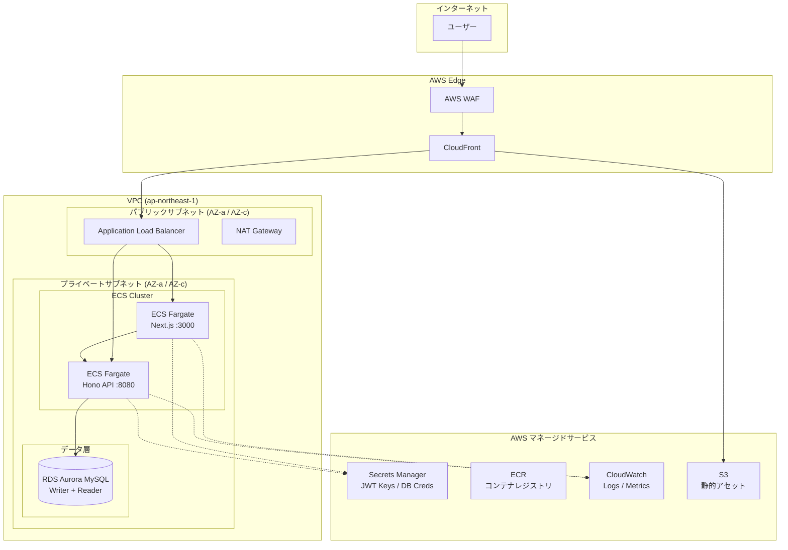
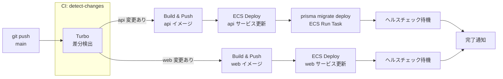

# AWS デプロイ構成案
## budget-management-tool — 本番運用アーキテクチャ設計書

**作成日**: 2026-04-13
**対象ブランチ**: `main`（feature/migrate-to-prisma マージ後想定）

---

## 0. 実際の技術スタック（確認済み）

| 項目 | 内容 |
|------|------|
| Frontend | Next.js (App Router) — `apps/web` |
| Backend | **Hono** on Node.js — `apps/api` |
| API 仕様 | `@hono/zod-openapi` による OpenAPI 自動生成 |
| 認証 | `jose` + RSA256 JWT（秘密鍵/公開鍵ペア） |
| ORM | Prisma 6.x |
| DB | MySQL 8.x |
| パッケージ管理 | pnpm Workspaces + Turborepo |

> **Hono の特性メモ**: Web Standard API（`Request`/`Response`）ベースのため、Node.js 以外のランタイム（Bun, Cloudflare Workers 等）へも移行可能。この特性は将来の構成変更コストを低減する。

---

## 1. インフラ構成案（High Level Architecture）

### 1.1 全体構成図



---

### 1.2 コンピューティングサービス選定

#### 選定: **ECS Fargate（Frontend / Backend 共通）**

| 比較対象 | 理由で却下 |
|----------|-----------|
| **AWS Amplify** | Next.js App Router の Server Actions / Route Handlers は対応しているが、Monorepo（pnpm workspaces）のビルド制御が困難。カスタムビルドコマンドの柔軟性が低い |
| **App Runner** | シンプルで魅力的だが、VPC 内リソース（RDS）へのプライベート接続設定が複雑。ALB を挟んだルーティング制御が弱い |
| **Lambda（SSR）** | Next.js の App Router は Cold Start の影響を受けやすく、Prisma Client の初期化コストも大きい。本番 UX に不向き |
| **ECS Fargate ✅** | pnpm + Turborepo のカスタムビルドを Dockerfile で完全制御可能。ALB によるパスベースルーティングで FE/BE を統一エンドポイントに集約できる。VPC 内プライベート通信で RDS への直接接続が容易 |

#### ALB ルーティング設計

```
https://app.example.com/api/*  → ECS: Hono API (Target Group: api-tg)
https://app.example.com/*      → ECS: Next.js  (Target Group: web-tg)
```

> Next.js の `NEXT_PUBLIC_API_URL` を相対パス（`/api`）に設定することで、CORS 問題を回避しつつ単一ドメイン運用が可能。

---

### 1.3 データベース選定

#### 選定: **Amazon Aurora MySQL Serverless v2**

| 項目 | 内容 |
|------|------|
| エンジン | Aurora MySQL 8.0 互換 |
| 構成 | Writer 1 台 + Reader 1 台（最小構成） |
| スケーリング | Serverless v2 — ACU 0.5〜16（トラフィックに応じて自動スケール） |
| バックアップ | 自動スナップショット 7 日間保持 |
| フェイルオーバー | Aurora の自動フェイルオーバー（約 30 秒） |

**Prisma との接続注意点**:

```prisma
// schema.prisma
datasource db {
  provider = "mysql"
  url      = env("DATABASE_URL")
  // Aurora Serverless v2 は通常の MySQL 接続で動作するため変更不要
}
```

> **Serverless v2 を選んだ理由**: 個人向けツールの特性上、深夜〜早朝はほぼゼロトラフィック。最小 ACU 0.5 まで縮退するため、RDS MySQL の固定インスタンスコスト（`db.t3.micro` ≈ $15/月）より経済的になる可能性が高い。ただし Aurora は RDS MySQL より基本料金が高めのため、トラフィックが安定したら RDS MySQL `db.t3.medium` との費用比較を推奨。

---

### 1.4 静的アセット（S3 / CloudFront）

```
CloudFront Distribution
├── /api/*         → ALB Origin（Hono API）
├── /_next/static/* → S3 Origin（Next.js 静的ビルド成果物）
└── /*             → ALB Origin（Next.js SSR）
```

| リソース | 役割 |
|---------|------|
| **S3** | `next export` 不使用のため静的ホスティングは不要。代わりに `_next/static/` の JS/CSS/画像をキャッシュ配信用にアップロード（任意最適化） |
| **CloudFront** | SSL 終端、WAF 統合、グローバルエッジキャッシュ、`_next/static/*` の長期キャッシュ（`Cache-Control: immutable`） |

> **シンプル構成の代替**: CloudFront を省略し ALB + ACM（SSL証明書）のみにすることも可能。エッジキャッシュが不要な場合はコスト削減になる。

---

## 2. Monorepo 最適化デプロイ戦略

### 2.1 Dockerfile 設計（マルチステージビルド）

**共通戦略: pnpm の `--filter` と Turbo のビルドキャッシュを活用**

#### `apps/api/Dockerfile`

```dockerfile
# ── Stage 1: 依存関係インストール ──────────────────────
FROM node:22-alpine AS deps
RUN corepack enable && corepack prepare pnpm@latest --activate

WORKDIR /repo

# pnpm workspace 解決に必要なファイルのみコピー（レイヤーキャッシュ最大化）
COPY pnpm-lock.yaml pnpm-workspace.yaml package.json ./
COPY apps/api/package.json ./apps/api/
COPY packages/common/package.json ./packages/common/

# --frozen-lockfile で再現性を保証
RUN pnpm install --frozen-lockfile

# ── Stage 2: ビルド ────────────────────────────────────
FROM deps AS builder

COPY packages/common ./packages/common
COPY apps/api ./apps/api
COPY turbo.json ./

# common を先にビルド（api が依存）
RUN pnpm --filter @budget/common run build
RUN pnpm --filter @budget/api run build

# ── Stage 3: 本番イメージ ──────────────────────────────
FROM node:22-alpine AS runner
RUN corepack enable && corepack prepare pnpm@latest --activate

WORKDIR /app

# 本番依存のみインストール
COPY --from=builder /repo/pnpm-lock.yaml ./
COPY --from=builder /repo/pnpm-workspace.yaml ./
COPY --from=builder /repo/package.json ./
COPY --from=builder /repo/apps/api/package.json ./apps/api/
COPY --from=builder /repo/packages/common/package.json ./packages/common/

RUN pnpm install --frozen-lockfile --prod

# ビルド成果物のみコピー
COPY --from=builder /repo/apps/api/dist ./apps/api/dist
COPY --from=builder /repo/packages/common/dist ./packages/common/dist
COPY --from=builder /repo/apps/api/prisma ./apps/api/prisma

# Prisma Client 生成（エンジンバイナリが必要）
RUN pnpm --filter @budget/api exec prisma generate

EXPOSE 8080
ENV NODE_ENV=production

CMD ["node", "apps/api/dist/index.js"]
```

#### `apps/web/Dockerfile`（Next.js standalone モード）

```dockerfile
# ── Stage 1: 依存関係インストール ──────────────────────
FROM node:22-alpine AS deps
RUN corepack enable && corepack prepare pnpm@latest --activate

WORKDIR /repo

COPY pnpm-lock.yaml pnpm-workspace.yaml package.json ./
COPY apps/web/package.json ./apps/web/
COPY packages/common/package.json ./packages/common/
COPY packages/api-client/package.json ./packages/api-client/
COPY packages/api-spec/package.json ./packages/api-spec/

RUN pnpm install --frozen-lockfile

# ── Stage 2: ビルド ────────────────────────────────────
FROM deps AS builder

COPY packages/ ./packages/
COPY apps/web ./apps/web
COPY turbo.json ./

# 依存パッケージを順次ビルド
RUN pnpm --filter @budget/common run build
RUN pnpm --filter @budget/api-spec run build 2>/dev/null || true
RUN pnpm --filter @budget/api-client run build

ENV NEXT_TELEMETRY_DISABLED=1
ENV NODE_ENV=production
RUN pnpm --filter web run build

# ── Stage 3: 本番イメージ（standalone 活用）────────────
FROM node:22-alpine AS runner

WORKDIR /app
ENV NODE_ENV=production
ENV NEXT_TELEMETRY_DISABLED=1

# Next.js standalone は依存を自己完結させる
COPY --from=builder /repo/apps/web/.next/standalone ./
COPY --from=builder /repo/apps/web/.next/static ./apps/web/.next/static
COPY --from=builder /repo/apps/web/public ./apps/web/public

EXPOSE 3000
CMD ["node", "apps/web/server.js"]
```

> **`next.config.js` に追加が必要**:
> ```js
> output: 'standalone'
> ```

---

### 2.2 CI/CD パイプライン（GitHub Actions）



#### `.github/workflows/deploy.yml` 骨格

```yaml
name: Deploy to AWS

on:
  push:
    branches: [main]

env:
  AWS_REGION: ap-northeast-1
  ECR_REGISTRY: ${{ secrets.AWS_ACCOUNT_ID }}.dkr.ecr.ap-northeast-1.amazonaws.com

jobs:
  # ── 差分検出 ──────────────────────────────────────────
  detect-changes:
    runs-on: ubuntu-latest
    outputs:
      api: ${{ steps.filter.outputs.api }}
      web: ${{ steps.filter.outputs.web }}
    steps:
      - uses: actions/checkout@v4
      - uses: dorny/paths-filter@v3
        id: filter
        with:
          filters: |
            api:
              - 'apps/api/**'
              - 'packages/common/**'
            web:
              - 'apps/web/**'
              - 'packages/**'

  # ── API ビルド & デプロイ ─────────────────────────────
  deploy-api:
    needs: detect-changes
    if: needs.detect-changes.outputs.api == 'true'
    runs-on: ubuntu-latest
    steps:
      - uses: actions/checkout@v4

      - name: Configure AWS credentials
        uses: aws-actions/configure-aws-credentials@v4
        with:
          role-to-assume: ${{ secrets.AWS_DEPLOY_ROLE_ARN }}  # OIDC 推奨
          aws-region: ${{ env.AWS_REGION }}

      - name: Login to ECR
        uses: aws-actions/amazon-ecr-login@v2

      - name: Build and push API image
        run: |
          IMAGE_TAG=${{ github.sha }}
          docker build -f apps/api/Dockerfile \
            -t $ECR_REGISTRY/budget-api:$IMAGE_TAG \
            -t $ECR_REGISTRY/budget-api:latest .
          docker push $ECR_REGISTRY/budget-api:$IMAGE_TAG
          docker push $ECR_REGISTRY/budget-api:latest

      - name: Run DB migration (ECS Run Task)
        run: |
          aws ecs run-task \
            --cluster budget-cluster \
            --task-definition budget-migration \
            --launch-type FARGATE \
            --network-configuration "..."
          # タスク完了まで待機
          aws ecs wait tasks-stopped ...

      - name: Deploy to ECS
        uses: aws-actions/amazon-ecs-deploy-task-definition@v1
        with:
          task-definition: ecs/api-task-def.json
          service: budget-api-service
          cluster: budget-cluster
          wait-for-service-stability: true

  # ── Web ビルド & デプロイ ─────────────────────────────
  deploy-web:
    needs: detect-changes
    if: needs.detect-changes.outputs.web == 'true'
    runs-on: ubuntu-latest
    steps:
      # deploy-api と同様の構造（省略）
      - run: echo "Web deploy steps..."
```

> **GitHub Actions OIDC 認証を推奨**: `AWS_ACCESS_KEY_ID` をシークレットに保存する代わりに、IAM の OIDC プロバイダーを設定して `role-to-assume` でロールを引き受ける方式が現在のベストプラクティス（鍵のローテーション不要）。

---

## 3. セキュリティと環境管理

### 3.1 JWT 秘密鍵の管理

#### 推奨: **AWS Secrets Manager**（Parameter Store との比較）

| | Secrets Manager | SSM Parameter Store |
|---|---|---|
| **用途** | RSA 秘密鍵（高機密） | 接続文字列・設定値 |
| **自動ローテーション** | ✅ Lambda 連携で可能 | ❌ |
| **バージョン管理** | ✅ | ✅（SecureString） |
| **料金** | $0.40/シークレット/月 | 無料（標準） |
| **選定** | **JWT_PRIVATE_KEY** | DATABASE_URL, 環境変数 |

#### ECS タスクロールでの参照設計

```
ECS タスク起動
    ↓
タスクロール（IAM）
    ↓ SecretsManager:GetSecretValue
Secrets Manager
    ├── /budget/prod/jwt-private-key  → JWT_PRIVATE_KEY
    ├── /budget/prod/jwt-public-key   → JWT_PUBLIC_KEY
    └── /budget/prod/db-password      → DB パスワード
```

**ECS タスク定義での注入**（コンテナ内で環境変数として参照可能）:

```json
{
  "secrets": [
    {
      "name": "JWT_PRIVATE_KEY",
      "valueFrom": "arn:aws:secretsmanager:ap-northeast-1:123456789:secret:/budget/prod/jwt-private-key"
    }
  ]
}
```

> `gen-keys.ts` で生成した RSA 鍵を初回セットアップ時に Secrets Manager へ手動登録する運用フローを確立すること。CI/CD からの鍵生成・自動登録は避ける（CI 環境への秘密鍵露出リスク）。

---

### 3.2 VPC ネットワーク設計

```
VPC: 10.0.0.0/16 (ap-northeast-1)
│
├── パブリックサブネット
│   ├── 10.0.1.0/24 (AZ-a)  ← ALB, NAT Gateway
│   └── 10.0.2.0/24 (AZ-c)  ← ALB (冗長化)
│
└── プライベートサブネット
    ├── 10.0.11.0/24 (AZ-a)  ← ECS Fargate (web, api)
    ├── 10.0.12.0/24 (AZ-c)  ← ECS Fargate (冗長化)
    ├── 10.0.21.0/24 (AZ-a)  ← RDS Aurora
    └── 10.0.22.0/24 (AZ-c)  ← RDS Aurora (Multi-AZ)
```

#### セキュリティグループ設計

```
sg-alb (ALB)
  Inbound:  0.0.0.0/0 → 443 (HTTPS), 80 (HTTP→リダイレクト)
  Outbound: sg-ecs → 3000, 8080

sg-ecs (ECS Fargate)
  Inbound:  sg-alb → 3000 (web), 8080 (api)
  Outbound: sg-rds → 3306
             0.0.0.0/0 → 443 (Secrets Manager, ECR via NAT)

sg-rds (Aurora MySQL)
  Inbound:  sg-ecs → 3306
  Outbound: なし
```

> ECS Fargate は ECR や Secrets Manager との通信に NAT Gateway 経由が必要（プライベートサブネット配置のため）。コスト削減には VPC Endpoint（ECR / Secrets Manager 用）の設置も検討。

---

### 3.3 WAF と監視の最小構成

#### WAF（AWS WAF v2）— CloudFront に関連付け

```
有効化推奨ルール（AWSマネージドルール）:
  ├── AWSManagedRulesCommonRuleSet       — OWASP Top 10 基本対策
  ├── AWSManagedRulesKnownBadInputsRuleSet — インジェクション対策
  └── AWSManagedRulesSQLiRuleSet         — SQLインジェクション対策

レートリミット（カスタムルール）:
  └── /api/auth/* → 同一 IP から 100 req/5min でブロック
```

#### CloudWatch 最小監視セット

```
メトリクスアラーム:
  ├── ECS: CPUUtilization > 80% → SNS通知
  ├── ECS: MemoryUtilization > 85% → SNS通知
  ├── ALB: HTTPCode_Target_5XX_Count > 10/min → SNS通知
  ├── RDS: DatabaseConnections > 80 → SNS通知
  └── RDS: FreeStorageSpace < 5GB → SNS通知

ログ収集:
  ├── ECS コンテナログ → CloudWatch Logs（/budget/api, /budget/web）
  ├── ALB アクセスログ → S3（分析用）
  └── RDS 一般クエリログ → CloudWatch Logs（開発時のみ）
```

---

## 4. 想定コスト（東京リージョン / 月額概算）

| サービス | 構成 | 概算 |
|---------|------|------|
| ECS Fargate (web) | 0.25vCPU / 512MB × 1 タスク | ~$8 |
| ECS Fargate (api) | 0.25vCPU / 512MB × 1 タスク | ~$8 |
| Aurora Serverless v2 | 最小 0.5 ACU〜 | ~$20〜 |
| ALB | 1 台 | ~$18 |
| NAT Gateway | 1 台 | ~$35 |
| Secrets Manager | 3 シークレット | ~$1.2 |
| CloudFront | 低トラフィック想定 | ~$3 |
| WAF | マネージドルール 3 個 | ~$10 |
| **合計** | | **~$103〜/月** |

> **最大のコスト要因は NAT Gateway（$35）**。VPC Endpoint（ECR/Secrets Manager）を導入するか、開発初期は Fargate を Public Subnet に配置（セキュリティグループでアクセス制御）することでコストを削減可能。

---

## 5. トレードオフと懸念事項

| 項目 | 内容 | 対策 |
|------|------|------|
| **Prisma Cold Start** | Fargate 起動時に Prisma エンジンバイナリの初期化で数秒かかる | ECS の最小タスク数を 1 に維持（スケールゼロなし） |
| **pnpm の Docker キャッシュ** | `pnpm install` のキャッシュが効きにくい | `--mount=type=cache` による BuildKit キャッシュマウント活用 |
| **DB マイグレーションの安全性** | ゼロダウンタイムデプロイ中に `prisma migrate deploy` が走ると稼働中インスタンスに影響 | デプロイ前に専用 ECS Run Task でマイグレーションを先行実行し、後方互換性を維持する |
| **Next.js standalone の依存解決** | Monorepo の他パッケージへの依存が standalone に含まれないケースがある | `next.config.js` の `experimental.outputFileTracingRoot` をリポジトリルートに設定 |
| **Aurora Serverless v2 の最小コスト** | ACU 0.5 でも停止しないため、RDS MySQL t3.micro より高くなることがある | 月次でコスト比較し、トラフィックが安定したら固定インスタンスへ移行検討 |

### 将来の拡張ポイント

- **Hono → Cloudflare Workers 移行**: Hono は Web Standard API ベースのため、コンピューティングコスト削減目的で Edge へ移行可能（Prisma は D1/Hyperdrive 対応が必要）
- **読み取りスケール**: Aurora Reader エンドポイントへの接続を Prisma の `$connect` 時に切り替えることで読み取りスケールアウト対応

---

*本ドキュメントは `apps/api`（Hono）・`apps/web`（Next.js）・`apps/api/prisma/schema.prisma` の実装を直接参照して作成。*
